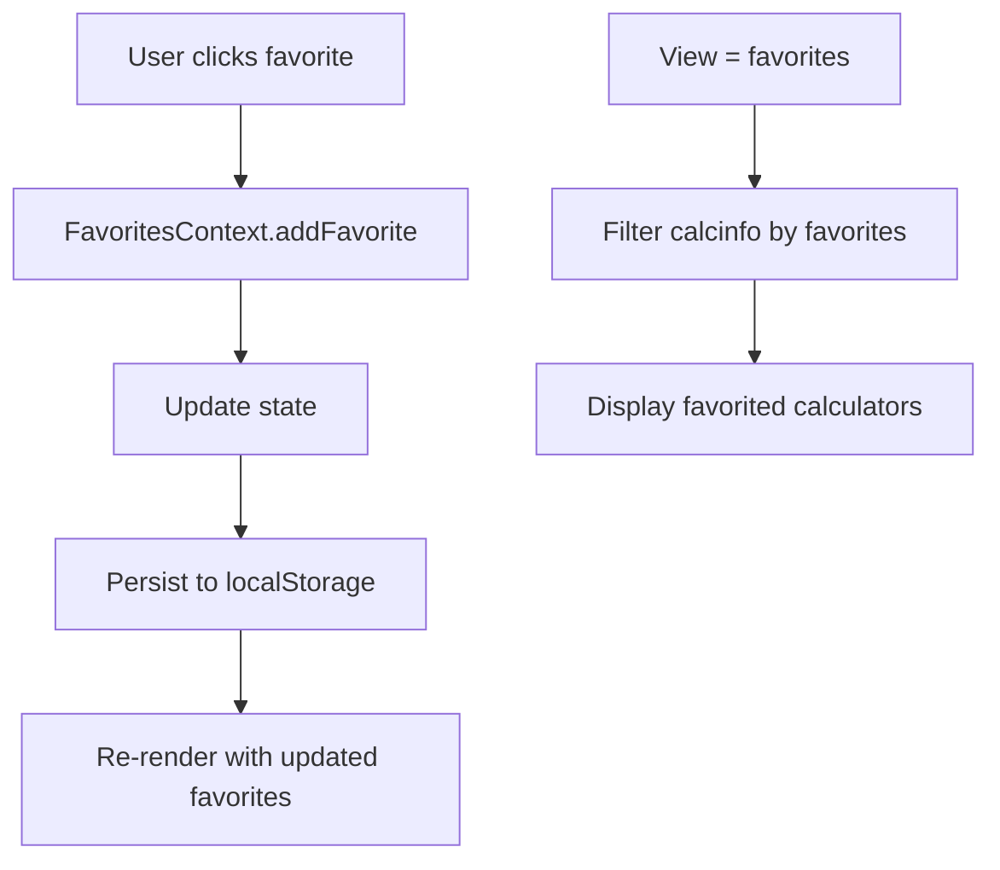

# Favorites Feature Implementation Plan

## Overview
Add a favorites feature to CalcForDocs that allows users to mark calculators as favorites and view them in a dedicated "favorites" view. This implementation focuses on the backend logic and data structure without UI changes.

## Architecture Analysis

### Current Structure
- **View System**: The app uses a view-based filtering system with predefined categories in `ARRANGEMENTS` object
- **State Management**: Uses React Context (PatientContext) for shared state
- **URL Routing**: Uses URL paths `/view/{viewName}` to sync view state
- **Data Source**: Calculator metadata stored in `calcinfo.json`

### Key Files
- [`src/CalcForDocs.js`](src/CalcForDocs.js) - Main app with view state, ARRANGEMENTS, and filtering logic
- [`src/calculators/calcinfo.json`](src/calculators/calcinfo.json) - Calculator metadata
- [`src/calculators/PatientContext.js`](src/calculators/PatientContext.js) - Existing context pattern to follow

## Implementation Plan

### Step 1: Create FavoritesContext.js
Create a new context for managing favorite calculator IDs:
- State: Array of favorite calculator IDs
- Methods: `addFavorite(id)`, `removeFavorite(id)`, `isFavorite(id)`
- Persistence: localStorage with key `calcfordocs_favorites`

### Step 2: Update CalcForDocs.js
- Import and wrap with `FavoritesProvider`
- Add `favorites` to the `ARRANGEMENTS` object (empty array - will be populated dynamically)
- Add `favorites` to the view toggle buttons array
- Update `filteredCalcs` logic to handle favorites view:
  - When view is `favorites`, filter calculators to only show favorited ones
  - Sort by the order they were favorited (most recent first)
- Add URL routing for `/view/favorites`

### Step 3: Update CalculatorGrid.js (Optional)
- Add favorite toggle button to each calculator card
- This would be a minimal UI change - just a star icon

## Data Flow



## Technical Details

### FavoritesContext API
```javascript
// Context value shape
{
  favorites: string[],           // Array of calculator IDs
  addFavorite: (id) => void,     // Add to favorites
  removeFavorite: (id) => void,  // Remove from favorites
  isFavorite: (id) => boolean,   // Check if favorited
  toggleFavorite: (id) => void   // Toggle favorite status
}
```

### localStorage Schema
```json
["map_calculator", "shock_index", "bmi_calculator"]
```

### URL Routing
- `/view/favorites` - Show only favorited calculators
- Favorites are preserved across sessions via localStorage

## Benefits of This Approach
1. **No UI changes required** - The favorites view can be accessed via URL
2. **Persistent** - Favorites survive page reloads and browser restarts
3. **Extensible** - UI can be added later to toggle favorites
4. **Follows existing patterns** - Uses the same context and view system as the app

## Future UI Enhancements (Not in Scope)
- Star icon on calculator cards
- "Add to favorites" button in calculator header
- Favorite count indicator
- Clear all favorites option